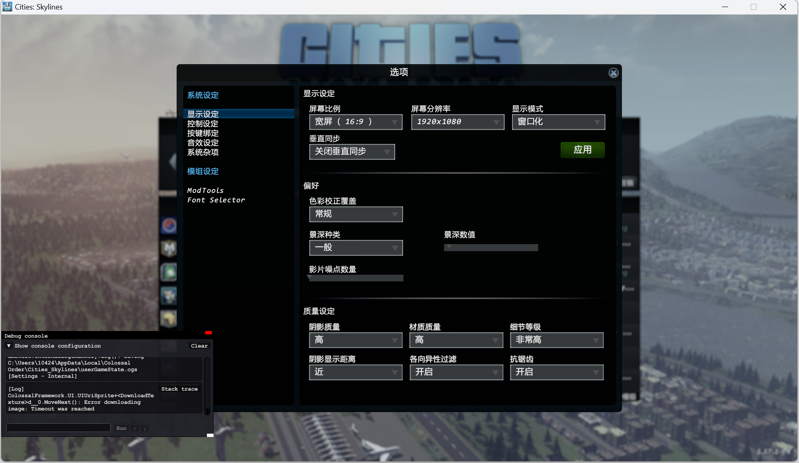

# Ai-agent
<div align="center">
# Notice

We are still working on further cleaning up the code and constantly updating it. We are also extending Cradle to more games and software. Feel free to reach out!


# Project Setup

Please setup your environment as:
```bash
conda create --name Ai-agent python=3.10
conda activate Ai-agent
pip3 install -r requirements.txt
```

### To install GroundingDino:

Download its weights to the cache directory:

```bash
mkdir cache
cd cache
curl -L -C - -O https://github.com/IDEA-Research/GroundingDINO/releases/download/v0.1.0-alpha2/groundingdino_swinb_cogcoor.pth
cd ..
```

**Note:**
You should have a CUDA environment, please make sure you have properly installed CUDA dependencies first. You can use the following command to detect it on Linux.
```bash
nvcc -V
```

Or search for its environment variable: CUDA_HOME or CUDA_PATH. On Windows it should be something like "C:\Program Files\NVIDIA GPU Computing Toolkit\CUDA\v11.8" and on Linux like "/usr/local/cuda".

If you don't get the specific version, you should download cudatoolkit and cuDNN first (version 11.8 is recommended).

If you don't download CUDA correctly, after installing GroundingDino, the code will produce:

```bash
NameError: name '_C' is not defined
```

If this happened, please re-setup CUDA and pytorch, reclone the git and perform all installation steps again.

On Windows install from https://developer.nvidia.com/cuda-11-8-0-download-archive (Linux packages also available).

Make sure pytorch is installed using the right CUDA dependencies.

```bash
conda install pytorch torchvision cudatoolkit=11.8 -c nvidia -c pytorch
```

If this doesn't work, or you prefer the pip way, you can try something like:

```bash
pip3 install --upgrade torch==2.1.1+cu118 -f https://download.pytorch.org/whl/torch_stable.html
pip3 install torchvision==0.16.1+cu118 -f https://download.pytorch.org/whl/torch_stable.html
```

Now, you should install the pre-compiled GroundingDino with the project dependencies. You can use the package in our repo and the following commands:

```bash
cd deps
pip install groundingdino-0.1.0-cp310-cp310-win_amd64.whl
cd ..
```

Once it is installed, we need to pre-download some required model files and set some environment variables.

```bash
# Define the necessary environment variables, this can be done in the .env file in the /cradle directory
HUGGINGFACE_HUB_CACHE = "./cache/hf" # This can be the full path too, if the relative one doesn't work

# Pre-download huggingface files needed by GroundingDino
# This step may require a VPN connection
# Windows user needs to run it in git bash
mkdir $HUGGINGFACE_HUB_CACHE
huggingface-cli download bert-base-uncased config.json tokenizer.json vocab.txt tokenizer_config.json model.safetensors --cache-dir $HUGGINGFACE_HUB_CACHE

# Define the last necessary environment variable, this can be done in the .env file in the /cradle directory
# This step will avoid needing a VPN to run
TRANSFORMERS_OFFLINE = "TRUE"
```

If for some reason there is some incompatibility in installing or running GroundingDino, it's recommended to recreate your environment.

Only if really necessary, you can try to clone and compile/install GroundingDino yourself.

```bash
# Clone
cd ..
git clone https://github.com/IDEA-Research/GroundingDINO.git
cd GroundingDINO

# Build and install it
pip3 install -r requirements.txt
pip3 install .
cd ../Cradle
```

It should install without errors and now it will be available for any project using the same conda environment (cradle-dev).

To build the C++ code on Windows, you may need to install build tools.

Download them from https://visualstudio.microsoft.com/visual-cpp-build-tools/
Make sure to select "Desktop Environment with C++" and include the 1st 3 optional packages:
- MSVC v141 or higher
- Windows SDK for your OS version
- CMake tools

### To install the videosubfinder for the gather information module

Download the videosubfinder from https://sourceforge.net/projects/videosubfinder/ and extract the files into the res/tool/subfinder folder. We have already created the folder for you and included a test.srt, which is a required dummy file that will not affect results.

The file structure should be like this:
- res
  - tool
    - subfinder
      - VideoSubFinderWXW.exe
      - test.srt
      - ...

#### Tunning videosubfinder
Use res/tool/general.clg to overwrite res/tool/subfinder/settings/general.cfg file.
To get the best extraction results, you can tune the subfinder by changing the parameters in the settings/general.cfg file. You may follow the readme me in Docs folder to get more information about the parameters.
Only modify it if absolutely necessary. Values have already been tuned to game scenario and environment setup.

### To install the OCR tools
```
1. Option 1
# Download best-matching version of specific model for your spaCy installation
python -m spacy download en_core_web_lg

or

# pip install .tar.gz archive or .whl from path or URL
pip install https://github.com/explosion/spacy-models/releases/download/en_core_web_lg-3.7.1/en_core_web_lg-3.7.1.tar.gz

2. Option 2
# Copy this url https://github.com/explosion/spacy-models/releases/download/en_core_web_lg-3.7.1/en_core_web_lg-3.7.1.tar.gz
# Paste it in the browser and download the file to res/spacy/data
cd res/spacy/data
pip install en_core_web_lg-3.7.1.tar.gz
```

## General guidelines

Always, **always**, **ALLWAYS** get the latest /main branch.

Any file with text content in the project in the resources directory (./res) should be in UTF-8 encoding. Use the cradle.utils to open/save files.


## Infra code

### 1. OpenAI provider

OpenAI provider now can expose embeddings and LLM from OpenAI and Azure together. Users only need to create one instance of each and pass the appropriate configuration.

Example configurations are in /conf. To avoid exposing sensitive details, keys and other private info should be defined in environmental variables.

The suggested way to do it is to create a .env file in the root of the repository (never push this file to GitHub) where variables can be defined, and then mention the variable names in the configs.

Please check the examples below.

Sample .env file containing private info that should never be on git/GitHub:
```
OA_OPENAI_KEY = "abc123abc123abc123abc123abc123ab"
AZ_OPENAI_KEY = "123abc123abc123abc123abc123abc12"
AZ_BASE_URL = "https://abc123.openai.azure.com/"
```

Sample config for an OpenAI provider:
```
{
	"key_var" : "OA_OPENAI_KEY",
	"emb_model": "text-embedding-ada-002",
	"comp_model": "gpt-4-vision-preview",
	"is_azure": false
}
```


## Game Settings


### 1. Change windows settings before running the code.



## Getting Started

To run the agent, follow these steps:

1- Launch the  game

2- To start from the beginning of Chapter #1, after you lauch the game, pass all introductory videos

3- Pause the game

4- Launch the framework agent with the command:

```
python run.py 
```


